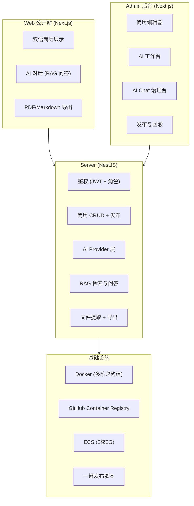

## 为什么写这篇

my-resume 始于两年前。前公司倒闭，找工作的间隙写博客，在掘金发了篇[《学习 TailwindCSS 顺便打造个性化在线简历》](https://juejin.cn/post/7334929489195909170)——Vue3 + Vite 静态简历站，双语 + 主题 + TailwindCSS，就这些。

评论里有人问怎么不做自动化部署。我答：不会。

一晃 2026 年了。

这两年 AI 走过了几个阶段：写出来的代码不能用 → Tab 补全很舒服 → 能写业务代码了 → "前端药丸"的声音越来越响。

前端的路在哪？这个问题我想了很久，在后面写出来和大家讨论讨论。

这里就先回到正题吧。**毕竟不发出来就没锚点。** 

---

## 项目是什么

一句话：**一个学习Demo，以 AI 驱动的个人简历系统。**

- Web 公开站：[resume.fridolph.top](https://resume.fridolph.top)
- Admin 后台：[admin-resume.fridolph.top](https://admin-resume.fridolph.top)
- 源码：[github.com/Fridolph/my-resume](https://github.com/Fridolph/my-resume)

三端各干各的：



---

## 技术选型：为什么选这些

| 层级 | 选择 | 理由 |
|---|---|---|
| Monorepo | pnpm workspace + Turbo | 三端共享类型和工具包，本地 dev 三端并行跑 |
| 前端 | Next.js 15 + React 19 + HeroUI v3 + Tailwind CSS v4 | Web 需要 SSR/SEO，Admin 需要 CSR 交互 |
| 后端 | NestJS 11 + Drizzle ORM + SQLite/libsql | 唯一后端承载全部业务，SQLite 适合个人项目规模 |
| AI | 多 Provider 适配器（mock / deepseek / openai-compatible） | 开发用 mock（免费），上线切真实 provider |
| RAG | 语义分块 + 嵌入 + 余弦/关键词混合检索 + 5 层重排管道 | 让 AI 基于真实简历内容回答，不是幻觉 |
| 部署 | Docker 多阶段构建 + GHCR + ECS + 一键脚本 | 2核2G 就够了，构建不上服务器 |

学习的同时，尝试下新的技术，把链路完整走一遍。

一个原则：**学习上最新，但不选过重的方案。** 向量数据库现在用 JSON 索引 + SQLite 内存余弦已经够了，Milvus 只在本地开发时开，ECS 上不跑。339 条 chunk 不需要它。


---

## 发布踩坑

docker 用过踩了坑，算是有点感觉，跟拆前端组件挺像：

- 1个大镜像 发布等很久；
- 按不同的包，拆成三个；但还是慢 ORZ
- 基础设施（就像打包优化 拆公共的chunk） + 三端可以分开构建（微服务）

```bash
# 打 tag
git tag v2.3.1 && git push --tags

# 一键构建 + 推送 + 发布
./deploy/ecs/release-from-local.sh --tag v2.3.1 --ecs-host <ip>

# 脚本自动做：
#   构建三端 Docker 镜像（server 5阶段 / web 4阶段 / admin 4阶段）
#   推送镜像到 GHCR
#   SSH 到 ECS，pull + compose up
#   健康检查三个域名
```

出问题了，`rollback.sh` 回滚，3 秒切到上一个版本。

从"SSH 上服务器 npm run build"到"一条命令发版"，中间踩了六个坑，写了十几个脚本。（还在都是AI写）

---

## 当前项目存在的问题

光是个静态简历也没啥意义，反正也要学习AI，于是就暂时弄了这几个：

- **简历分析**（上传文本 → AI 结构化报告）
- **简历导入识别**（上传 MD/TXT → 异步 Job 状态机 → AI 识别 → 三道校验防线 → 用户确认回填）
- **RAG 问答**（提问 → 向量检索 → 5 层重排 → LLM 生成回答 + 引用）。

诚实说，这部分写出来不是炫耀，是正视。如果你想用当然欢迎，但请注意项目里还有很多坑：

**性能还没优化。** 首屏约 280KB JS，CSS 约 450KB（HeroUI 全量导入），刚做了第一轮基线测量。

**安全校验不完整。** API 输入没有全量覆盖 Zod schema。自己用也要有完整校验，这不是借口。

**RAG 检索质量还不稳定。** 语义分块刚切上，没有跑过系统的对比实验，效果靠感觉。

**组件库样式问题** 一开始手写还好，但随着需求增多，就选了个组件库学习的同时免折腾（但没配好skill AI更折腾了）

写下来，是清单，不是自我否定。知道问题在哪，是解决问题的第一步。

---

## 侃侃过去、当下和未来

这个问题，在"前端药丸"的声音越来越响的时候，很难不去想。

说来惭愧，我 16 年毕业入行。那时候还在 jQuery，收藏了一堆插件，以为这就是武器库了。

后来项目重构，上了 Webpack + React，那两年很挠——明明页面写得挺舒服，一加 JSX 看多了 `{}` 就晕，再把 Redux 加进来，一个单向数据流到我这仿佛开了岔路。

后面公司用 Vue，又重新学，有 React 基础很快适应了。经历了前端娱乐圈各种撕逼，现在回头看，不都是我中有你、你中有我吗？框架换了一茬又一茬，本质其实差不多。

前端每一次被"颠覆"，都是因为有什么东西变了：

**2005 年，Ajax 横空出世。** 页面不再需要整页刷新，前端交互第一次有了真正的生命力。前后端分离从此开始，前端从"切图仔"变成了一个独立的工种。

**Grunt → Gulp → Webpack → Vite。** 构建工具一代代迭代，前端用了将近十年，把自己从"写写 html jQuery"变成了一个有完整工程项目体系的领域。

**Angular / React / Vue 三大框架时代。** 组件化、响应式、虚拟 DOM，TypeScript 的类型支持，前端的复杂度上了一个台阶，能承载的产品也越来越复杂。

然后 AI 来了。不是"前端药丸"，是**前端的地基在扩张**。

每一次技术浪潮，淘汰的不是前端工程师，是停在原地的那部分。Webpack 出来，不学构建的人被边缘化；框架时代，不懂组件化的人被边缘化；现在 AI 来了，不懂怎么把 AI 能力接进产品的人，会慢慢被边缘化。

不可否则，由于 AI 的"提效"让很多岗位消失了，现在就是 AI 的野蛮扩张时期。

但反过来说——**懂的人，地盘反而更大了。** 

毕竟 AI 有一个阶段 Human in the Loop，这不是可选，是必须。我现在的判断是两件事叠在一起：

**一，全栈视角是必要的。**

不是说前端要去写后端、搞运维，而是需要理解一个完整产品是怎么跑起来的。

做这个项目之前，我其实有过一个转变时刻——开始认真看后端同事画的流程图和数据流向图。看懂了数据怎么流，很多前端的决策就不一样了。比如表单提交：前端做好发请求前的校验，意味着什么？意味着 POST Body 里不会塞满类型不符的数据，后端少做一层防御，接口返回也更干净。反过来，如果接口返回的空数据是 `[]` 而不是 `null`，前端能少掉多少莫名的页面报错。

这些事情不难，但需要你把视角从"我这一层"拉出来，看整条链路。后端同事常念叨的锁、并发、事务，前端不需要精通，但知道它们在解决什么问题，协作的时候就不会说外行话。

不再以"前端/后端"的视角把一个完整产品割裂开来——这是全栈视角的起点。在 AI 的辅助下，我们不必样样精通，但不能有认知盲区。

**二，AI 是新的基础设施，不是替代品。**

就像当年 Webpack 出来，前端要学构建，顺带要了解 Node.js；现在 AI 出来，前端要学"怎么把 AI 的能力接进产品"——SSE 流式输出、结构化输出、RAG、prompt 工程、Token 成本控制、错误重试机制。

听起来是新名词，但做过就知道，每一个背后都是具体的坑。比如流式输出，断流怎么处理、错误怎么重试、前端怎么渲染一个还在生成中的 JSON——这些坑踩完，就是你的基本功。就像当年搞懂 Webpack 的 loader 和 plugin 一样，没有捷径，踩过才算会。

这些会成为新的基本功，就像现在的组件化和工程化一样。

在 AI 的辅助下，一个人能做的事情边界在扩大。以前一个人搞不定的全栈系统，现在可以搞定。以前不懂的领域，AI 可以帮你快速建立认知。但前提是你得先动手，先在实践里摔过跤，才知道该问什么问题。

---

最后说说焦虑这件事。

现代人不断被社会、就业形势所逼，还有来自家庭的压力。我自己的解法是：**技、身、心，三修。**

技，磨炼技艺，我们吃饭的家伙，程序员持续学习精进，共勉。
身，培养项锻炼身体的爱好，我打羽毛球，现在每天也会站桩、八段锦，打打太极，身体是一切的底座。
心，王阳明说："圣人之道，吾性自足，不假外求。" 在事上磨，顺应变化。AI 的大势阻挡不了，那就跟上它，困难本身也是机遇。

拨开迷雾，找到那个趋于稳定的方向，然后一直走下去。

这个项目对我来说，也是这样一个过程。

---

## 写在最后

**先发出来，再往前走。** 知行合一，接着就结合自己的学历历程，慢慢更新学习笔记和实战了。

| 项目 | 说明 |
|---|---|
| [github.com/Fridolph/my-resume](https://github.com/Fridolph/my-resume) | 当前的个人简历项目 |
| [blog.fridolph.top](https://blog.fridolph.top) | 个人技术博客，Astro 推荐一下，从 Hexo/Valaxy 迁移而来 |
| [ai-journey-fighting](https://fridolph.github.io/AI-Journey-Fighting) | AI 学习路线与实战笔记，Agent / RAG / 工具链 |
| [ai-journey-land](https://github.com/Fridolph/ai-journey-land) | AI 学习相关 Demo 验证与实践 |
| [FE-interview-preview](https://fridolph.github.io/FE-prepare-interview) | 前端面试知识体系，交互式复习工具 |

技术会变，框架会变，AI 会继续颠覆很多东西。但一个一直在动手、一直在实践、一直在正视自己问题的工程师，不会被淘汰。

接下来的文章，会继续写这个项目的迭代——踩坑、设计、和那些"太简单太基础"的问题是怎么一个个补上的。

感谢您看到现在，谢谢支持 ~

---

> *昇哥 · 2026年6月*
