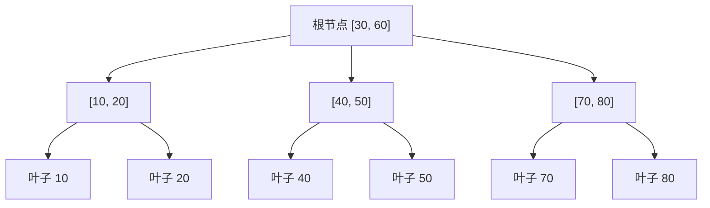
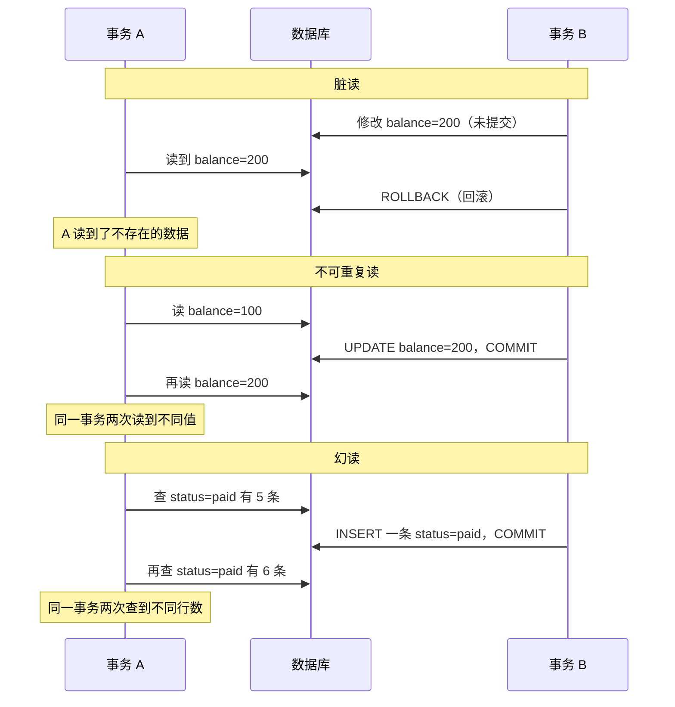
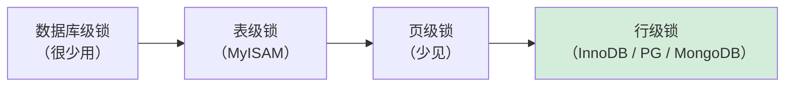
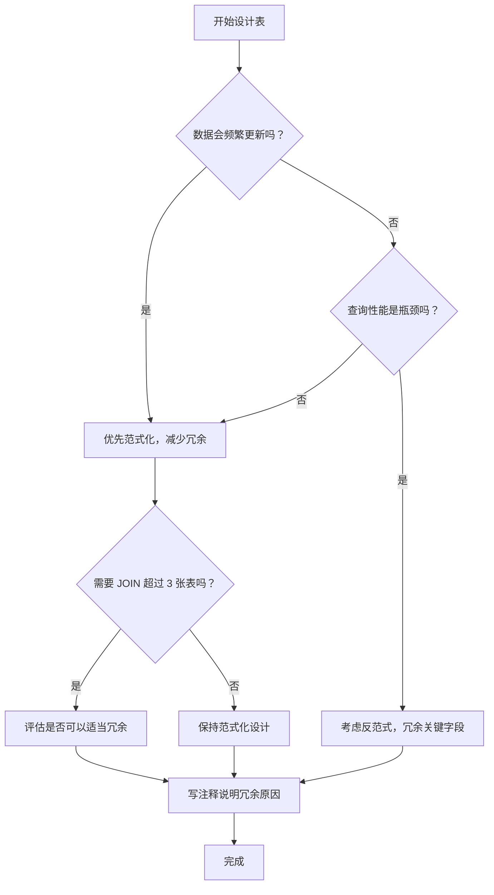
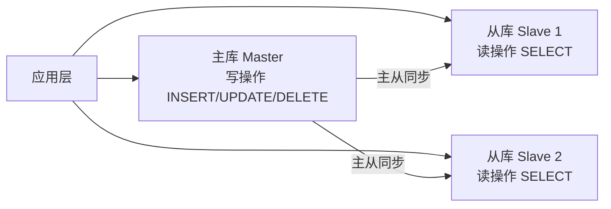

> 数据库不只是 CRUD。这篇文章把索引原理、事务隔离、锁机制、表设计范式这四个核心概念掰开揉碎，配合实际代码和正反例子，建立跨数据库的通用心智模型。

---

## 一、索引：数据库的目录

### 1.1 一句话理解

**索引就是数据库的目录。**

没有索引，查一条记录要扫全表（全表扫描）。有索引，数据库直接跳到对应位置（索引查找）。

```text
有索引：查 id=500 → 读 3~4 个索引页 → 定位 1 个数据页 → 完成
无索引：查 id=500 → 扫描全部 10000 页 → 找到 → 完成
```

这不是夸张。一张百万行的表，没有索引的查询可能要几秒，加了索引之后变成几毫秒。

### 1.2 B-Tree 索引原理

最常见的是 B-Tree 索引，结构像一棵平衡的多叉树：



查找 id=45 的过程：

1. 读根节点 → 45 在 30 和 60 之间 → 走中间分支
2. 读中间节点 [40, 50] → 45 在 40 和 50 之间 → 走对应叶子
3. 定位叶子节点 → 找到数据指针 → 读取数据页

每次读取把搜索范围对半缩小——这就是**二分查找思想**，时间复杂度 O(log n)。

**为什么是 B-Tree 而不是普通二叉树？**

因为数据库数据在磁盘上，每次读取是以"页"为单位（通常 16KB）。B-Tree 的每个节点可以存很多 key，一次磁盘 I/O 就能读一整个节点，减少磁盘访问次数。普通二叉树每个节点只有 2 个分支，树太高，磁盘 I/O 次数太多。

### 1.3 索引的最佳实践

**✅ 正例：给 WHERE / JOIN / ORDER BY 的高频字段建索引**

```sql
-- 场景：用户表，经常按 email 登录查询
-- 没有索引：全表扫描 100 万行
SELECT * FROM users WHERE email = 'sheng@example.com';

-- 建索引
CREATE INDEX idx_users_email ON users(email);

-- 现在走索引，查询从 800ms → 1ms
```

**✅ 正例：联合索引遵循"最左前缀"原则**

```sql
-- 场景：订单表，经常按 user_id + status 查询
CREATE INDEX idx_orders_user_status ON orders(user_id, status);

-- ✅ 能走索引（最左前缀匹配）
SELECT * FROM orders WHERE user_id = 1;
SELECT * FROM orders WHERE user_id = 1 AND status = 'paid';

-- ❌ 不能走索引（跳过了最左列 user_id）
SELECT * FROM orders WHERE status = 'paid';
```

**❌ 反例：在低基数字段上建索引**

```sql
-- ❌ 错误：给 gender 字段建索引
-- gender 只有 'male' / 'female' 两个值，索引区分度极低
-- 数据库往往直接走全表扫描，索引形同虚设
CREATE INDEX idx_users_gender ON users(gender);

-- ✅ 正确：给高基数字段建索引（email、phone、order_no）
-- 这些字段值几乎唯一，索引区分度高，效果显著
```

**❌ 反例：对索引列做函数运算**

```sql
-- ❌ 错误：对 created_at 做函数运算，索引失效
SELECT * FROM orders WHERE YEAR(created_at) = 2026;

-- ✅ 正确：改成范围查询，索引生效
SELECT * FROM orders
WHERE created_at >= '2026-01-01' AND created_at < '2027-01-01';
```

### 1.4 索引不是免费的

每次 INSERT / UPDATE / DELETE，索引也要同步更新。**一张表的索引越多，写入越慢。**

```text
索引是"空间换时间"的权衡：
查询快 ←→ 写入慢
索引少 ←→ 索引多
```

一个真实的教训：有人给一张日志表的每个字段都建了索引，结果写入速度下降了 80%。日志表是写多读少的场景，根本不需要那么多索引。

**原则**：给 WHERE、JOIN、ORDER BY 中高频使用的字段建索引，不为每个字段都建。

### 1.5 用 EXPLAIN 验证索引是否生效

不管用什么数据库，都有 EXPLAIN 命令来查看查询计划：

```sql
EXPLAIN SELECT * FROM orders WHERE user_id = 1 AND status = 'paid';
```

关注 `type` 列（MySQL）或 `Scan` 类型（PostgreSQL）：

| 类型 | 含义 | 是否需要优化 |
|---|---|---|
| `ALL` / `Seq Scan` | 全表扫描 | ⚠️ 需要优化 |
| `ref` / `Index Scan` | 走索引查找 | ✅ 良好 |
| `const` / `Index Only Scan` | 主键等值 / 只读索引 | ✅ 最优 |

---

## 二、事务：数据库的"保险机制"

### 2.1 一句话理解

**事务 = 一组操作要么全部成功，要么全部撤销。**

转账是最经典的例子：

```sql
BEGIN;
  UPDATE accounts SET balance = balance - 100 WHERE id = 1;  -- A 扣 100
  UPDATE accounts SET balance = balance + 100 WHERE id = 2;  -- B 加 100
COMMIT;
```

如果扣完 A 的钱后系统崩了，B 没收到钱——数据库必须能回退（ROLLBACK）。

### 2.2 ACID 四特性

| 特性 | 含义 | 违反的例子 |
|---|---|---|
| **A**tomicity 原子性 | 全部成功或全部撤销 | 转账中途崩溃，钱扣了没到账 |
| **C**onsistency 一致性 | 数据约束始终成立 | 余额变成负数 |
| **I**solation 隔离性 | 并发事务互不干扰 | 同时读到正在修改的中间状态 |
| **D**urability 持久性 | 提交后永久保存 | 数据库重启后数据丢失 |

（ACID 的详细展开在上一篇已经讲过，这里不重复。）

### 2.3 隔离级别与并发问题

隔离性是 ACID 里最复杂的一个，也是面试最爱考的。

先理解三个并发问题：



四个隔离级别对应的防护能力：

| 隔离级别 | 脏读 | 不可重复读 | 幻读 | 性能 |
|---|---|---|---|---|
| READ UNCOMMITTED | 可能 | 可能 | 可能 | 最高 |
| READ COMMITTED | ✅ 不会 | 可能 | 可能 | 高 |
| REPEATABLE READ | ✅ 不会 | ✅ 不会 | 可能 | 中 |
| SERIALIZABLE | ✅ 不会 | ✅ 不会 | ✅ 不会 | 最低 |

- **MySQL InnoDB 默认**：REPEATABLE READ（用间隙锁一定程度防幻读）
- **PostgreSQL 默认**：READ COMMITTED（MVCC 实现，性能更好）

### 2.4 事务最佳实践

**✅ 正例：把相关操作包在同一个事务里**

```sql
-- 场景：创建订单，同时扣减库存
BEGIN;
  INSERT INTO orders (user_id, product_id, amount) VALUES (1, 101, 299);
  UPDATE products SET stock = stock - 1 WHERE id = 101;
COMMIT;
-- 如果任何一步失败，整个事务回滚，不会出现"订单建了但库存没扣"
```

**❌ 反例：事务范围太大**

```sql
-- ❌ 错误：把发邮件、调第三方 API 也包进事务
BEGIN;
  INSERT INTO orders ...;
  UPDATE products SET stock = stock - 1 ...;
  -- 调用第三方支付 API（网络请求，可能超时 30 秒！）
  -- 发送邮件通知...
COMMIT;
-- 事务持有锁的时间太长，严重影响并发性能
```

正确做法：数据库操作放事务，网络请求、邮件发送放事务外。


### 2.5 不同数据库的事务差异

| 数据库 | 事务支持 |
|---|---|
| MySQL / PG / SQLite | 天然支持，每个语句隐式事务，可显式 BEGIN/COMMIT |
| MongoDB | 4.0 前不支持多文档事务；4.0+ 支持但有性能开销；设计哲学是"通过嵌套文档避免事务" |
| Redis | 无传统事务；MULTI/EXEC 保证原子执行但不回滚；用 Lua 脚本实现原子性 |
| ES | 不支持跨文档 ACID 事务 |

**一句话**：事务需求越强，越应该用关系型数据库。

---

## 三、锁：并发控制

### 3.1 一句话理解

**锁 = 并发控制机制。** 两个人同时改同一行数据，数据库用锁排队。

### 3.2 锁的层次



现代数据库（MySQL InnoDB、PostgreSQL、MongoDB WiredTiger）默认都是**行级锁**——A 改第 1 行，B 改第 2 行，互不影响。

**关键前提**：WHERE 条件必须走索引。如果没命中索引 → 全表扫描 → 锁全表。

### 3.3 乐观锁 vs 悲观锁

| | 悲观锁 | 乐观锁 |
|---|---|---|
| 思路 | "肯定有人跟我抢，先锁" | "大概没人抢，改了再说" |
| 实现 | `SELECT ... FOR UPDATE` | 版本号 / 时间戳 |
| 适合 | 冲突多（秒杀扣库存） | 冲突少（编辑个人信息） |

```sql
-- 悲观锁（MySQL / PG）
BEGIN;
SELECT * FROM products WHERE id = 101 FOR UPDATE;  -- 锁住这一行
UPDATE products SET stock = stock - 1 WHERE id = 101;
COMMIT;  -- 提交后自动释放锁
```

```sql
-- 乐观锁（应用层实现版本号）
-- 读取时记录 version
SELECT id, stock, version FROM products WHERE id = 101;
-- → stock=10, version=5

-- 更新时带上 version 条件
UPDATE products
SET stock = stock - 1, version = version + 1
WHERE id = 101 AND version = 5;
-- 如果 version 已经被别人改成 6，这条 UPDATE 影响行数为 0
-- 应用层检测到影响行数=0，重试整个流程
```

### 3.4 锁的最佳实践

**✅ 正例：秒杀场景用悲观锁**

```sql
-- 场景：秒杀最后 1 件商品，高并发冲突概率极高
BEGIN;
SELECT stock FROM products WHERE id = 101 FOR UPDATE;
-- 其他事务此时无法修改这行，排队等待

-- 应用层判断库存
-- IF stock > 0:
UPDATE products SET stock = stock - 1 WHERE id = 101;
INSERT INTO orders (user_id, product_id) VALUES (1, 101);
COMMIT;
-- ELSE: ROLLBACK（库存不足）
```

**✅ 正例：编辑文档用乐观锁**

```sql
-- 场景：多人协作编辑，冲突概率低
-- 用户 A 打开文档时，记录 version=10
-- 用户 A 保存时：
UPDATE documents
SET content = '新内容', version = version + 1
WHERE id = 1 AND version = 10;

-- 如果影响行数 = 0，说明有人在 A 编辑期间修改了文档
-- 提示用户"文档已被他人修改，请刷新后重试"
```

**❌ 反例：长事务持有锁**

```sql
-- ❌ 错误：事务开始后做了大量计算，长时间持有锁
BEGIN;
SELECT * FROM orders WHERE user_id = 1 FOR UPDATE;
-- ... 在应用层做了复杂的计算，花了 10 秒 ...
UPDATE orders SET status = 'processed' WHERE user_id = 1;
COMMIT;
-- 这 10 秒内，其他所有要修改这些行的事务都被阻塞
```

正确做法：先在事务外做好计算，再开事务，快速完成数据库操作。

---

## 四、范式与反范式：表怎么设计

### 4.1 三大范式

| 范式 | 规则 | 反例 | 正例 |
|---|---|---|---|
| **1NF** | 每列不可再分，每列只存一个值 | `tags = "学习,工作,生活"` 一列存多值 | 拆成 `tags` 关联表，每个标签一行 |
| **2NF** | 非主键列完全依赖主键（消除部分依赖） | 订单表同时存 `product_name`，它只依赖 `product_id` | `product_name` 放商品表，订单表只存 `product_id` |
| **3NF** | 非主键列不传递依赖主键（消除传递依赖） | 学生表存 `dept_phone`，电话依赖部门不依赖学生 | `dept_phone` 放部门表，学生表只存 `dept_id` |

### 4.2 实际项目中的权衡

**不要过度追求范式。** 真实项目经常"范式 + 反范式"混合：

```text
范式化 → 数据一致性好，但查询要做多个 JOIN
反范式化 → 查询快，但数据冗余，更新要同步多处
```

**✅ 正例：订单表冗余商品信息（合理的反范式）**

```sql
CREATE TABLE orders (
  id            BIGINT PRIMARY KEY,
  user_id       BIGINT NOT NULL,
  product_id    BIGINT NOT NULL,
  product_name  VARCHAR(200),   -- 冗余字段
  product_price DECIMAL(10,2),  -- 冗余字段
  created_at    TIMESTAMP
);
```

为什么合理？

- 商品可能改名、改价，但历史订单必须保留下单时的名称和价格
- 查订单列表不需要 JOIN 商品表，性能好
- 这是**有意为之的冗余**，不是设计失误

**❌ 反例：用户表冗余"最近一次登录信息"（不合理的反范式）**

```sql
-- ❌ 错误：把登录记录冗余到用户表
ALTER TABLE users ADD COLUMN last_login_ip     VARCHAR(50);
ALTER TABLE users ADD COLUMN last_login_city   VARCHAR(100);
ALTER TABLE users ADD COLUMN last_login_device VARCHAR(200);
-- 每次登录都要 UPDATE users，高并发下锁竞争严重
-- 这些字段和"用户"本身没有强关联，应该放独立的登录日志表
```

```sql
-- ✅ 正确：独立的登录日志表
CREATE TABLE login_logs (
  id         BIGINT PRIMARY KEY,
  user_id    BIGINT NOT NULL,
  ip         VARCHAR(50),
  city       VARCHAR(100),
  device     VARCHAR(200),
  created_at TIMESTAMP
);
-- 查最近登录：
SELECT * FROM login_logs WHERE user_id = ? ORDER BY created_at DESC LIMIT 1;
```

### 4.3 一个完整的设计决策流程



---

## 五、进阶概念速览

### 5.1 慢查询优化

**什么是慢查询？**

执行时间超过阈值的 SQL，通常是没走索引、JOIN 太多、或者数据量太大。

```sql
-- MySQL：开启慢查询日志
SET GLOBAL slow_query_log = 'ON';
SET GLOBAL long_query_time = 1;  -- 超过 1 秒记录

-- PostgreSQL：配置文件 postgresql.conf
log_min_duration_statement = 1000  -- 超过 1000ms 记录
```

**一个真实的优化案例：**

```sql
-- ❌ 慢查询：没有索引，全表扫描 200 万行，耗时 4.2s
SELECT * FROM user_actions
WHERE user_id = 1001 AND action_type = 'purchase'
ORDER BY created_at DESC
LIMIT 20;

-- 分析：WHERE 条件是 user_id + action_type，ORDER BY 是 created_at
-- ✅ 建联合索引，把 ORDER BY 的字段也带进去
CREATE INDEX idx_user_actions ON user_actions(user_id, action_type, created_at DESC);

-- 优化后：走索引，耗时 0.8ms，提升约 5000 倍
```

### 5.2 连接池

```text
应用 ← 连接池（10-20 个连接）← 数据库
```

数据库连接是昂贵的资源（建立一次连接需要 TCP 握手 + 认证，约 10-50ms）。不要每次请求都创建新连接。

**✅ 正例：NestJS + Prisma 全局单例**

```typescript
// ✅ 正确：lib/prisma.ts，全局单例，复用连接池
import { PrismaClient } from '@prisma/client'
const prisma = new PrismaClient()
export default prisma
```

**❌ 反例：每次请求 new PrismaClient()**

```typescript
// ❌ 错误：每次请求都建新连接，极慢
async function getUser(id: number) {
  const prisma = new PrismaClient()  // 每次都建新连接！
  const user = await prisma.user.findUnique({ where: { id } })
  await prisma.$disconnect()
  return user
}
```

### 5.3 读写分离



读写分离是初级性能优化手段——把读压力分散到多个从库。

**一个必须注意的坑：主从延迟**

```text
用户刚注册 → 写入主库 → 立刻查询（走从库）→ 查不到！
原因：主从同步有延迟（通常 10ms-1s，网络差时更长）
```

处理方式：刚写完的关键数据，强制读主库；或者把"刚注册"的 userId 写入 Redis，查询时先查 Redis，绕过从库延迟。

### 5.4 JSONB：PostgreSQL 的杀手级特性

PostgreSQL 支持将 JSON 数据以二进制格式存储（JSONB），同时保持 JSON 的灵活性：

```sql
-- 场景：用户的扩展属性（不同用户有不同的字段）
CREATE TABLE user_profiles (
  user_id    BIGINT PRIMARY KEY,
  extra_info JSONB,
  created_at TIMESTAMP
);

-- 对 JSONB 内部字段建 GIN 索引
CREATE INDEX idx_vip_level ON user_profiles ((extra_info->>'vip_level'));

-- 查询 JSONB 内部字段，走索引
SELECT * FROM user_profiles WHERE extra_info->>'vip_level' = '3';
-- 包含查询
SELECT * FROM user_profiles WHERE extra_info @> '{"tags": ["active"]}';
```

这让 PG 在"需要关系型的可靠性 + 文档型的灵活性"场景下无可替代。

---

## 六、学习建议

```text
1. 先过一遍 GUI 工具
   → 打开 Workbench/pgAdmin，浏览表结构、索引、ER 图
   → 对着真实的表结构，理解范式的意义

2. 建一个真实项目
   → 不一定要多复杂——一个 Card Learning Demo 就够了
   → 在"需要"中学，比在"应该"中学高效 10 倍

3. 核心三问（每次写 SQL 都问自己）
   → 这条 SQL 走索引了吗？（EXPLAIN 验证）
   → 这个操作需要事务吗？（多步操作就需要）
   → 并发写同一个数据怎么办？（锁还是版本号）

4. 一次只深入一个数据库
   → 先把 PG（或 MySQL）学透，再横向扩展
   → 索引、事务、锁这三个概念，在所有关系型数据库里是通用的
```

---

## 写在最后

这篇文章覆盖了数据库的"骨架知识"：索引原理、事务隔离、锁机制、表设计范式，以及慢查询、连接池、读写分离这些进阶概念。

这些东西，第一次看会觉得抽象。但只要在真实项目里踩过一次"没加索引导致查询超时"、或者"事务范围太大导致锁等待"，就会真的记住。

下一篇介绍 **Prisma ORM 入门**——如何用现代化的 TypeScript ORM 来操作 PostgreSQL，告别手写 SQL：[Prisma 入门——用 TypeScript 的方式管理数据库](/articles/2026-05-16__prisma-guide/)。

---

*昇哥 · 2026年5月*
*学数据库核心概念途中，顺手把想清楚的事写下来。*
