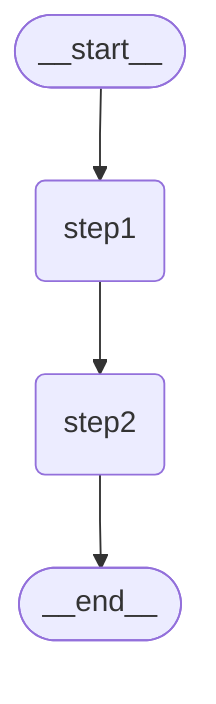

# 01 — basic-graph.mjs：第一个 LangGraph 图

> 学习日期：2026-05-21
> 原始文件：`examples/langgraph-test/src/basic-graph.mjs`

---

## 一、学习目标

- 跑通第一个 LangGraph 图
- 理解 **State / Node / Edge** 三原语如何变成代码
- 建立从"前端状态管理"到"LangGraph 图编排"的思维映射

---

## 二、代码逐层拆解

### 2.1 State 定义 — "图共享的黑板"

```js
const StateAnnotation = Annotation.Root({
  text: Annotation({
    reducer: (_prev, next) => next,
    default: () => "",
  }),
});
```

**一句话理解：** 这就是 TypeScript 声明 Redux Store 的类型，只不过用 Annotation API。

每个 `Annotation()` 会声明两件事：

| 参数 | 作用 | 前端类比 |
|------|------|---------|
| `reducer` | 多个节点都想改这个字段时，旧值和新值怎么合并 | Redux reducer 的 `(state, action) => newState` |
| `default` | 初始值，invoke 时没传这个字段就用它兜底 | React 的 `useState(defaultValue)` |

> `(_prev, next) => next` 意味着"新值覆盖旧值"，是**最简单粗暴**的 reducer。后面你会看到 `[...prev, next]`（数组追加）等更复杂的模式。

---

### 2.2 Node — "黑板前的操作工"

```js
const step1 = (state) => ({ text: `${state.text} -> step1` });
const step2 = (state) => ({ text: `${state.text} -> step2` });
```

**核心契约：**
- 接收：**完整**的全局 State（整个黑板）
- 返回：**只返回你要改的字段**（框架自动 merge 到全局 State）
- 不直接修改 state，而是返回"增量"

**前端类比：**

```js
// Redux reducer——你要自己手动 merge
const reducer = (state, action) => ({
  ...state,                     // ← 手动展开旧 state
  text: state.text + " -> step1" // ← 再覆盖要改的字段
});

// LangGraph node——框架帮你 merge
const step1 = (state) => ({ text: `${state.text} -> step1` });
// 你只需要说你改什么，框架自动保持其他字段不变
```

这个区别很微妙但很重要：LangGraph node 只返回"增量"（partial update），框架自动做 `{ ...prevState, ...nodeReturn }`。你不需要再写 `...state`，也不需要担心改了什么不该改的。

---

### 2.3 Edge — "谁之后是谁"

```js
const graph = new StateGraph(StateAnnotation)
  .addNode("step1", step1)      // ① 注册节点
  .addNode("step2", step2)
  .addEdge(START, "step1")      // ② 连边：入口 → step1
  .addEdge("step1", "step2")    // ③ step1 → step2
  .addEdge("step2", END)        // ④ step2 → 出口
  .compile();                   // ⑤ 冻结，准备执行
```

**链式 API，声明式编排。** 写完这段代码，就等于画好了下面这张图：

```
[START] → [step1] → [step2] → [END]
```

`compile()` 是关键一步——之前你可以随意加节点、改边线，compile 之后结构就锁定为"可执行态"。

| API | 作用 | 前端类比 |
|-----|------|---------|
| `addNode(name, fn)` | 注册一个处理节点 | 注册一个 Redux Reducer |
| `addEdge(from, to)` | 声明执行顺序 | 组建 middleware 管道 |
| `compile()` | 冻结图，准备执行 | webpack 打包完成 |
| `START` | 内置入口节点 | Redux `dispatch(action)` 的入口 |
| `END` | 内置出口节点 | Redux `store.getState()` 拿到结果 |

---

### 2.4 Mermaid 可视化

```js
const drawable = await graph.getGraphAsync();
const mermaid = drawable.drawMermaid({ withStyles: true });
```

LangGraph 内置的**图结构可视化**——把 "代码" 转成 "流程图"。打印到终端，可以直接粘贴到 Markdown 里渲染：



这个能力在调试时非常有用——你看不到代码执行过程，但能看到执行计划长什么样。

---

### 2.5 invoke — 点火执行

```js
const result = await graph.invoke({ text: "hello" });
```

| 概念 | 说明 |
|------|------|
| 输入 | 初始 State：`{ text: "hello" }` |
| 执行流 | `START → step1 → step2 → END` |
| 输出 | 最终 State：`{ text: "hello -> step1 -> step2" }` |

每一步的执行轨迹：

1. `START` 透传初始 state `{ text: "hello" }`
2. `step1` 收到 state，返回 `{ text: "hello -> step1" }` → 框架 merge 进全局 state
3. `step2` 收到 merge 后的 state `{ text: "hello -> step1" }`，返回 `{ text: "hello -> step1 -> step2" }` → 再次 merge
4. `END` 收到最终 state，invoke 返回

**关键理解：State 是"流经"每个节点的**，而不是"存在某个地方"。每个节点拿到的是当前最新的全局 state，改完传给下一个节点。

---

## 三、思维模型映射表

### 前端 → LangGraph 对照

为前端工程师量身打造的对照表：

| 前端概念 | LangGraph 概念 | 为什么像 |
|---------|---------------|---------|
| Redux **Store Schema** | `Annotation.Root()` | 都定义"共享数据长什么样" |
| Redux **Reducer** | `reducer: (_prev, next) => next` | 都决定"新值怎么覆盖旧值" |
| Redux **Reducer** | Node（处理函数） | 都接收 state，返回更新 |
| `dispatch(action)` → Reducer 链 | `invoke(state)` → Node 链 | 都触发一条执行链 |
| React **组件树** | `StateGraph + Edge` | 都声明式定义"谁之后是谁" |
| `const App = () => <A><B/></A>` | `.addNode("A", fn).addNode("B", fn)` | 都是声明式，不是命令式 |
| `useEffect` 依赖链 | Edge + compile 后的执行拓扑 | 都自动推导执行顺序 |
| `{ ...state, text: newText }` | Node 返回 `{ text: newText }` | 但 LangGraph 自动 merge，不用手写 `...state` |
| Webpack **打包** | `compile()` | 都做"冻结 + 优化" |
| `console.log(组件树)` | `drawMermaid()` | 都能把结构打印出来看 |

### 一句话定位

> **StateGraph = 声明式的数据管道**，你只管搭节点和接线，LangGraph 负责按拓扑顺序跑完所有节点，每次只传增量，自动 merge。

---

## 四、运行验证

```bash
cd examples/langgraph-test
node src/basic-graph.mjs
```

**预期输出：**

```
%%{init: {'flowchart': {'curve': 'linear'}}}%%
graph TD;
  __start__([__start__]):::first
  step1(step1)
  step2(step2)
  __end__([__end__]):::last
  __start__ --> step1;
  step1 --> step2;
  step2 --> __end__;

result: { text: 'hello -> step1 -> step2' }
```

第一块是 Mermaid 流程图代码，第二块是最终 state。

---

## 五、学习注释版

为方便回顾，创建了带详细中文注释的学习版文件：

```
examples/langgraph-test/src/basic-graph-learning.mjs
```

原始文件保持不变，学习版在每段代码前加了**为什么这样写**的解释。

---

## 六、核心洞察

### 🔑 State 是"流经每个节点的数据"，不是"存在哪里的数据"

第一反应可能会把 State 想象成一个"数据库"——你在节点 A 里写数据，在节点 B 里读。实际不是这样：

- **State 在 invoke 时创建**，从一个初始值开始
- **State 流经每个节点**，节点收到的是上一个节点改完之后的 state
- **节点返回增量**，框架自动 merge，然后传给下一个节点

这很像 Redux 的 middleware 链——每个 middleware 拿到 action，处理，传给下一个。但 LangGraph 更进一步——你不需要手动决定"传给谁"，Edge 声明决定了流向。

### 🔑 Reducer 决定了"多个节点改同一个字段时听谁的"

`(_prev, next) => next` 是最简单的，但想象一个场景：

- step1 给 `text` 追加 " -> step1"
- step2 也想给 `text` 追加 " -> step2"

如果两个节点"同时"执行（LangGraph 支持并行节点），它们看到的 `text` 都是 `"hello"`。没有 reducer 介入的话，后执行的那个会覆盖前一个的结果，`"hello -> step1"` 被丢掉。有了 reducer 机制，LangGraph 可以在冲突时决定怎么合并——这就是后面要深入的内容。

### 🔑 声明式 vs 命令式

如果不使用 LangGraph，用纯 JavaScript 实现同样的功能：

```js
// 命令式
let state = { text: "hello" };
state.text += " -> step1";
state.text += " -> step2";
```

看起来更简单对吧？但随着逻辑变复杂——条件分支、循环、并行、回退、中断——命令式代码会迅速膨胀成难以维护的"意大利面条"。LangGraph 把控制流变成了**声明式的图结构**，你看到的是"搭积木"，而不是"写流程"。

---

## 七、下一步预告

`basic-graph.mjs` 是**线性图**——一条路走到黑，没有分支。

下一个文件 `conditional-routing.mjs` 引入了**分叉**（条件路由）——根据输入内容，决定走 math 分支还是 chat 分支：

```js
// 预演：条件路由的核心模式
.addConditionalEdges("router", (state) => state.route, {
  math: "math",
  chat: "chat",
})
```

这会让你第一次感受到**图比函数链强在哪**——同一个节点可以指向不同的后继，不是写死的 `a() → b() → c()`。

---

## 八、文件清单

| 文件 | 说明 |
|------|------|
| `src/basic-graph.mjs` | 原始教程文件（不变） |
| `src/basic-graph-learning.mjs` | 本文件的学习注释版 |
| `drafts/langgraph-test/01-basic-graph.md` | 本篇学习记录 |

---

## 附录：reducer 快速理解实验

在 Node.js 里跑一下这段，秒懂 reducer：

```js
// LangGraph 帮你做的内部 merge 逻辑
const prevState = { text: "hello", count: 0 };

// step1 返回增量
const step1Return = { text: "hello -> step1" };

// 框架内部自动在做的事：
const newState = { ...prevState, ...step1Return };
// { text: "hello -> step1", count: 0 }
// count 字段自动保留，你不需要碰它
```
